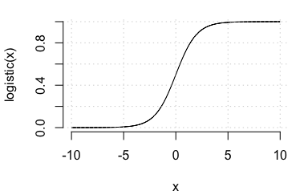

# A tale of two 2x2 tables

Welcome to (possibly) the world's first *choose your own statistical adventure*!

In this practical we are going to study the following two two-by-two tables, which come from two
published papers about genetic variants that affect malaria susceptibility:

```R
                       non-O      O                                          rs60822373   rs60822373
                       blood gp.  blood gp.                                  G allele     C allele
            controls:  3420       3233               unexposed populations:  1965         1
severe malaria cases:  3925       2738         malaria-exposed populations:  707          17
```

The left table contains data from <https://doi.org/10.1038/s41467-019-13480-z>, and shows that O blood group is at
lower frequency in severe malaria cases than in the general population, consistent with a protective effect of O blood
group.

The right table comes from <https://science.sciencemag.org/content/348/6235/711>, and shows that the rs60822373 'C'
alleles is at higher frequency in malaria-exposed population (here sub-Saharan Africans) than in non-exposed
populations (European-ancestry individuals). rs60822373 encodes the Cromer blood group, so this is consistent with a
protective effect of the Cromer blood group on malaria. (In this right table, the data actually comes from the [1000
Genomes Project phase I](http://www.nature.com/nature/journal/v491/n7422/full/nature11632.html)).

If you run a statistical test on either table you will see that these are highly statistically significant differences
in frequencies between the two rows of each table, so these differences are not just due to sampling.

But *something is wrong with one of these tables*.  Your mission is to find out what!

*QN*.  Maybe you can already see what is wrong?  Give it some thought before we proceed.

## Modelling 2x2 tables

To quantify the effects in both tables we need a model. In both tables, the data was collected based on the row labels
(i.e. case/control or population of collection) so the most straightforward model is of *binomial sampling in rows*.
In other words, for a table:
```

           X    Y        (total)
unexposed  a    b        (N₁ = a+b)
  exposed  c    d        (N₂ = c+d)
```
We model the counts of `Y` as:
```  
  b ~ binomial( n = N₁, p = ϑ₁ )
  d ~ binomial( n = N₂, p = ϑ₂ )
```
where ϑ₁ and ϑ₂ are frequencies in the two rows.

*Exercise* You can implement this model easily using the code we have already written - see [this file](../loglikelihoods/table.ll.R) for an implementation.

However, we'd really like to parameterise the model so that it contains an *effect size parameter* - a parameter that
reflects how different the two row frequencies are.  We will use the *log odds ratio* to do this.  In the above table, the observed log odds ratio is the quantity:


There are a couple of reasons to focus on log odds ratio here.  One of them is mathematical convenience.  For a probability p, the odds is defined as p/(1-p).  The odds lies in [0,∞] and thus the log-odds lies in [-∞,∞].  It is generally useful to have parameters living in an unbounded space.

Thus, transforming to log odds allows us to put our parameters on the real line.

Another way to think of this is through the inverse function, which maps log odds back to probability space.  This function is known as the *logistic* function and defined by:


Let's plot it:
```R
logistic <- function( x ) {
	exp(x) / ( 1 + exp(x) )
}

x = seq( from = -10, to = 10, by = 0.01 )
plot( x, logistic(x), type = 'l', bty = 'n' )
grid()
```



You can see that the logistic function maps the real line (log-odds space, x axis) to the unit interval (y axis, probability space).  It is smooth and tails off to being essentially flat outside around [-10,10].

*Exercise* prove that `logistic()` is the inverse of the log odds (hint: substitute one expression into the other and simplify). Alternatively, prove this to yourself by implementing both function in R.

Now that we are working in log-odds space (on the real line), this frees us up to express our log odds as a *baseline log odds* (applying to both rows of the table) plus an *additional log odds conferred by the second row*.  Let's call these parameters μ and β.  We are thus writing:


Or equivalently:


If you follow this maths through you will see the essential fact: parameter β is equal to the log odds ratio, 


The reparameterised model for our table is now:


Summarising, the log-odds ratio β is a real number which encodes the difference in frequency between the two rows of the table.
